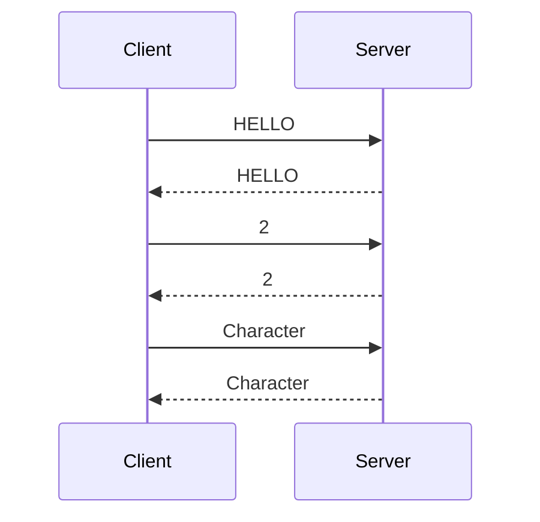

# Handshaking

Handshaking is the process of establishing a connection between two peers. It is a critical part of the protocol, as it is the only way to verify that the peer you are connected to is the peer you intended to connect to. It is also the only way to verify that the peer you are connected to is running the correct version of the protocol.

## Packets

:::caution
Packet **[Character (0x09)](../packets/09-character.mdx)** is unconfirmed to be part of the handshaking sequence. But it is currently assumed to be so.
:::

- [HELLO (0x01)](../packets/01-hello.mdx)
- [Unknown (0x02)](../packets/02-unknown.mdx)
- [Character (0x09)](../packets/09-character.mdx)

## Handshaking Sequence

1. Client to Server: [HELLO](../packets/01-hello.mdx)
2. Server to Client: [HELLO](../packets/01-hello.mdx)
3. Client to Server: [2](../packets/02-unknown.mdx)
4. Server to Client: [2](../packets/02-unknown.mdx)
5. Client to Server: [Character](../packets/09-character.mdx)
6. Server to Client: [Character](../packets/09-character.mdx)