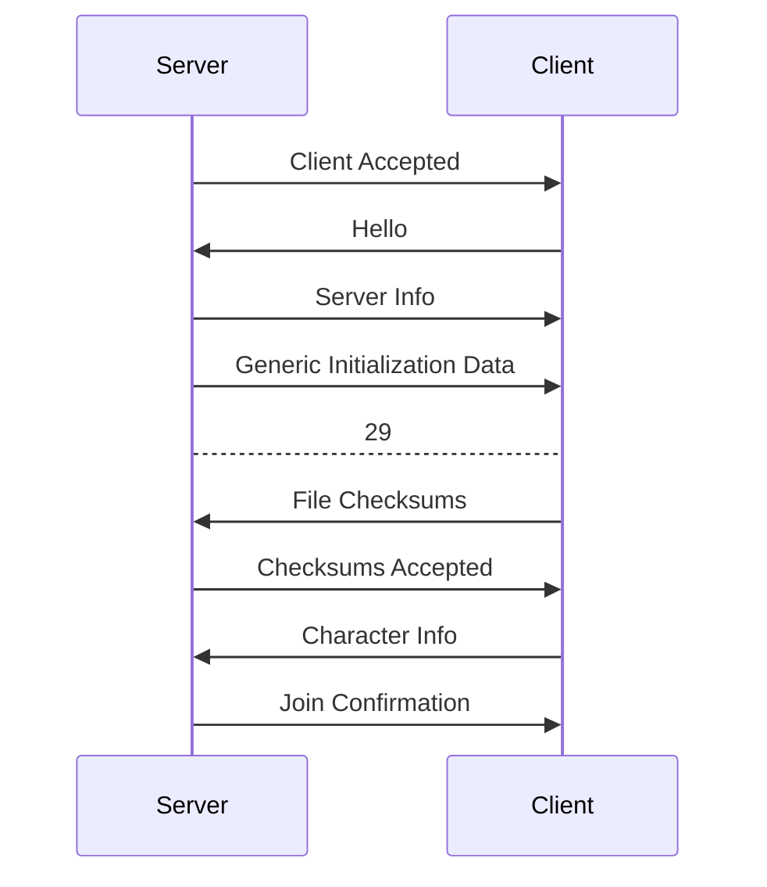
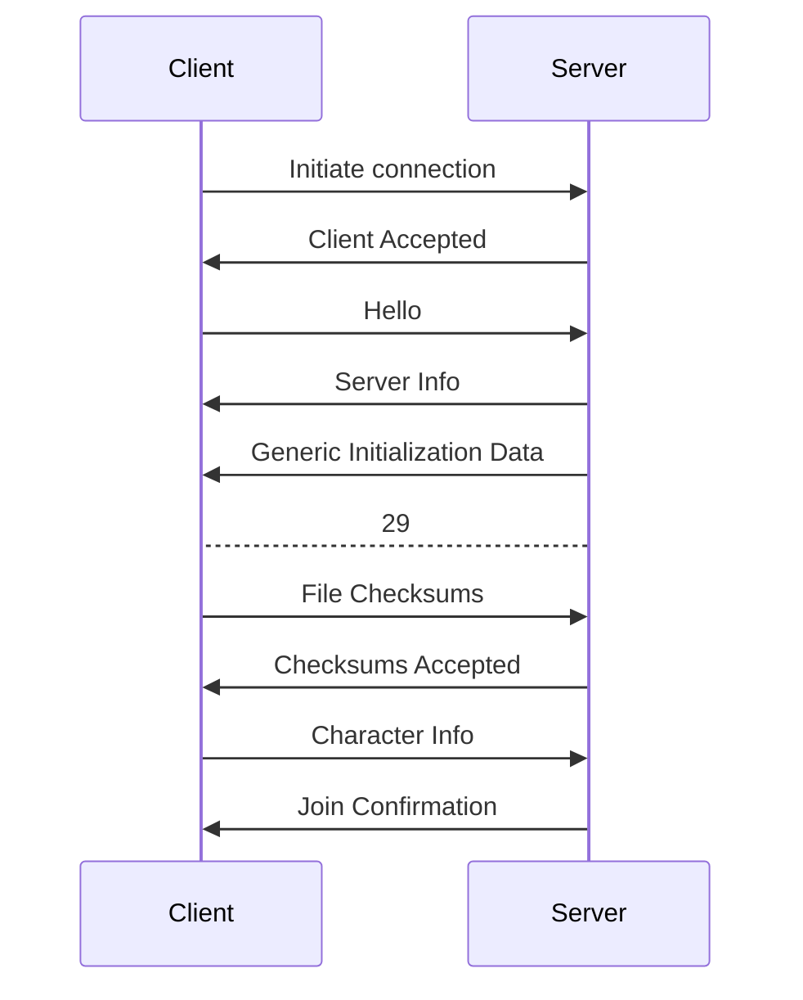
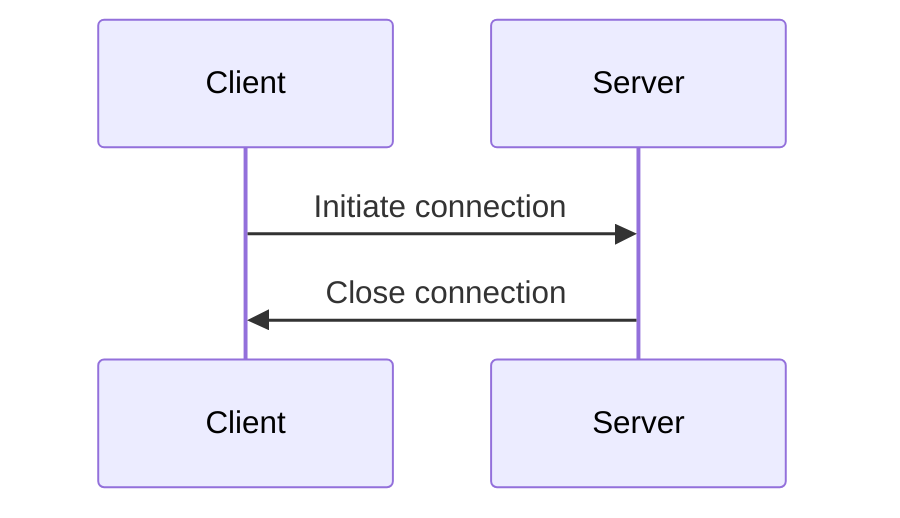
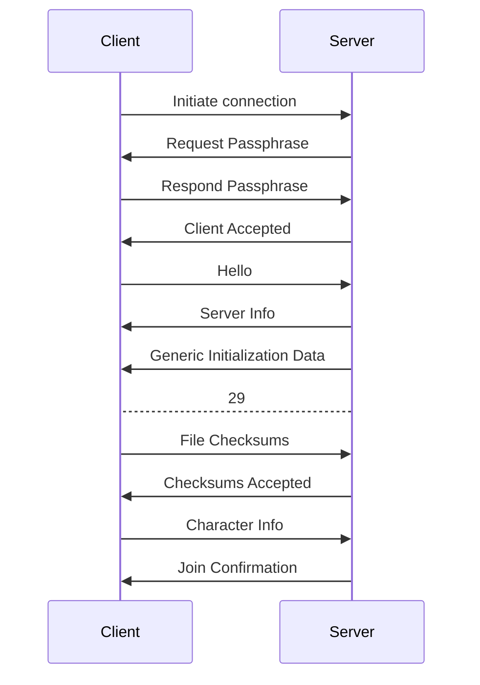

# Joining

Joining is the process of establishing a connection between two peers. It is a critical part of the protocol, as it is the only way to verify that the peer you are connected to is the peer you intended to connect to. It is also the only way to verify that the peer you are connected to is running the correct version of the protocol.

Joining packets range from packet ID `0` -> `13`.

## Packets

In the joining sequence, the following packets are used:
- [01 - Hello](../../packets/01-hello)
- [02 - Server Info](../../packets/02-server-info)
- [03 - Request Passphrase](../../packets/03-request-passphrase)
- [04 - Respond Passphrase](../../packets/04-respond-passphrase)
- [05 - Client Accepted](../../packets/05-client-accepted)
- [06 - File Checksums](../../packets/06-file-checksums)
- [07 - Checksums Accepted](../../packets/07-checksums-accepted)
- [08 - Checksums Denied](../../packets/08-checksums-denied)
- [09 - Character Info](../../packets/09-character-info)
- [10 - Join Confirmation](../../packets/10-join-confirmation)
- [13 - Generic Initialization Data](../../packets/13-generic-initialization-data)

## Joining Sequence

The joining sequence depends on the `Multiplayer` setting of the server.

### Public

### Friends Only

**If friended:**

**If un-friended:**

### Friends of Friends - WIP

**If friended:**

**If passphrase is valid:**

**If passphrase is invalid:**

Todo

### Private

## Troubleshooting

### Stuck after `Receiving initialization data...`

If you are stuck in the loading screen and the last line printed to the console is `Join request accepted`, verify that the server sends all blob data listed in the [2 - Server Info](../packets/02-server-info.mdx) packet.

### Stuck after `Join request accepted`

If you are stuck in the loading screen and the last line printed to the console is `Join request accepted`, it is likely that the server has not created a character for you.

### Missing name tags for player characters

If the character is created properly, but the name tag is missing, verify the server sends the [22 - Network Update](../packets/22-network-update.mdx) packet at least one tick after the [13 - Generic Initialization Data](../packets/13-generic-initialization-data.mdx) packet. If these packets are sent in the same tick, the name tag will not be displayed.
