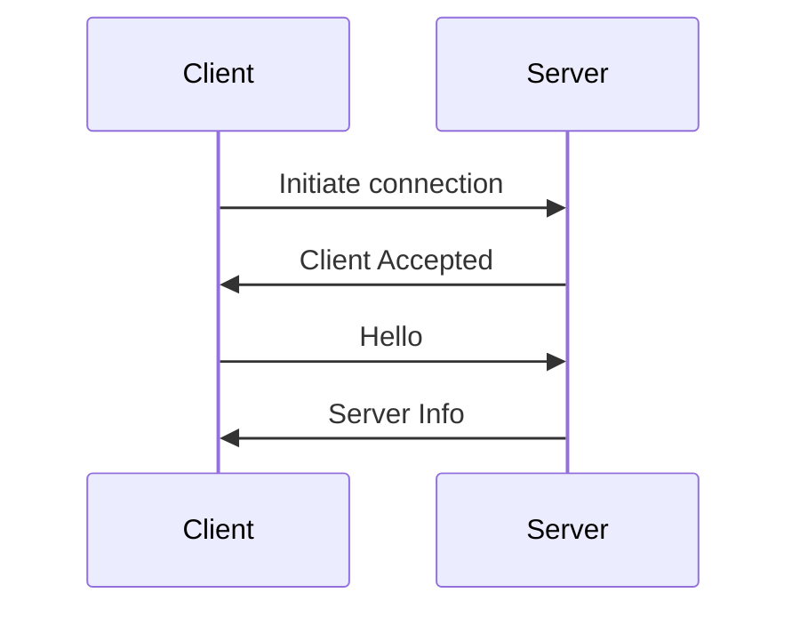
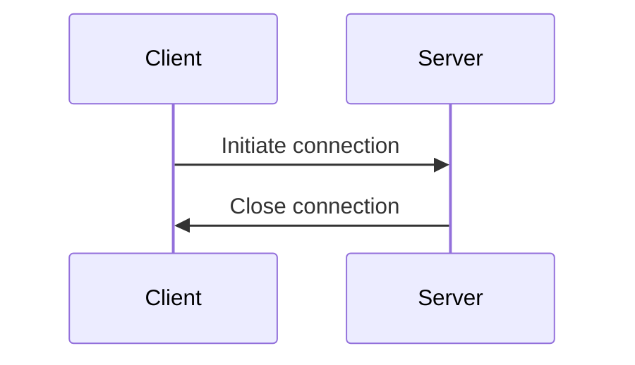
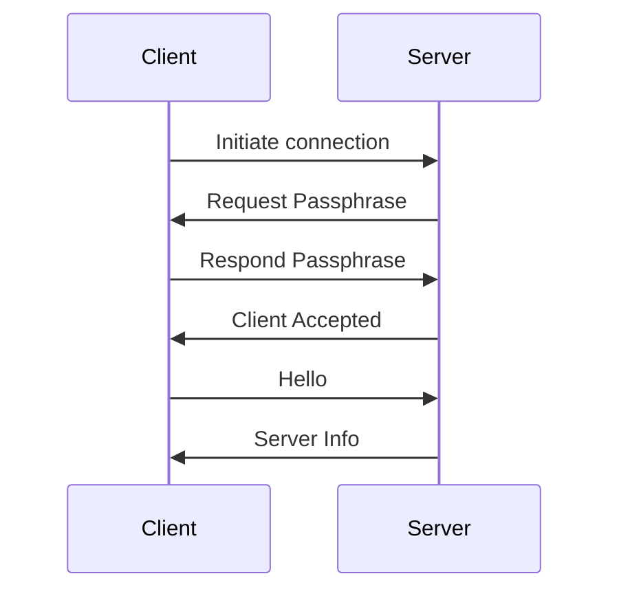

# Joining

Joining is the process of establishing a connection between two peers. It is a critical part of the protocol, as it is the only way to verify that the peer you are connected to is the peer you intended to connect to. It is also the only way to verify that the peer you are connected to is running the correct version of the protocol.

## Packets
IDs: 0x01 - 0x0D (13)
- [Hello](../packets/01-hello.mdx)
- [Server Info](../packets/02-server-info.mdx)
- [Request Passphrase](../packets/03-request-passphrase.mdx)
- [Respond Passphrase](../packets/04-respond-passphrase.mdx)
- [Client Accepted](../packets/05-client-accepted.mdx)
- [Character](../packets/09-character.mdx)

## Joining Sequence

The joining sequence depends on the `Multiplayer` setting of the server.

### Public

### Friends Only

**If friended:**

**If un-friended:**

### Friends of Friends

**If passphrase is valid:**

**If passphrase is invalid:**

Todo

### Private

