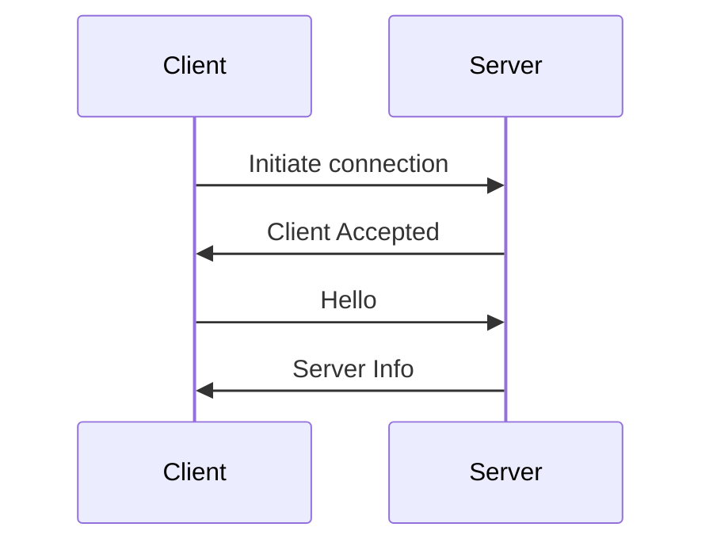
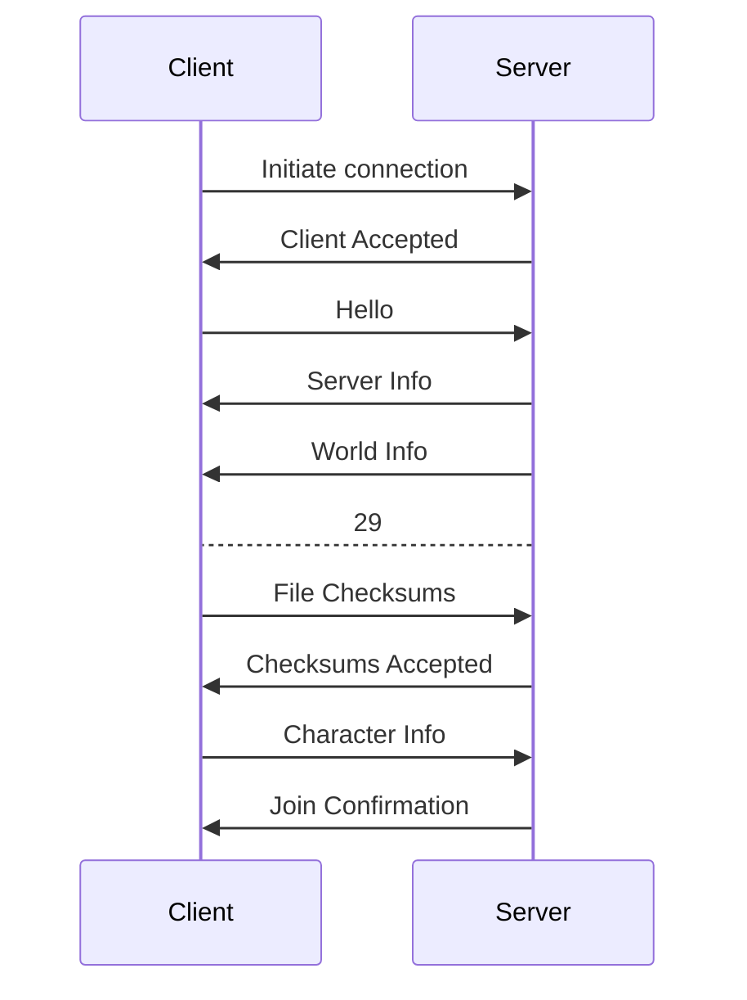
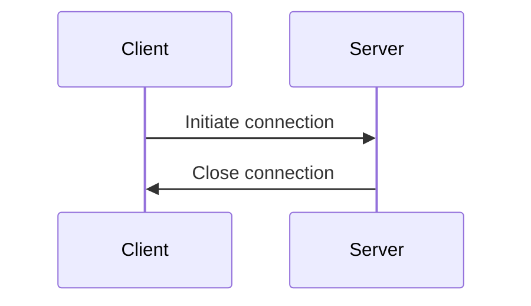
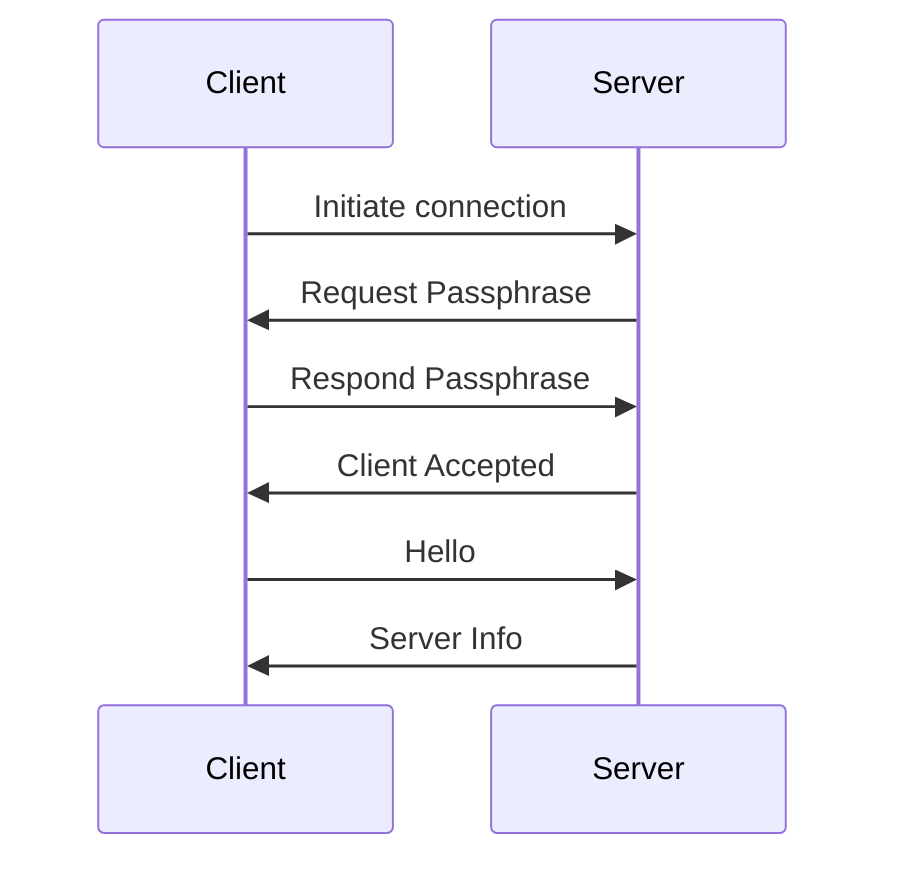

# Joining

Joining is the process of establishing a connection between two peers. It is a critical part of the protocol, as it is the only way to verify that the peer you are connected to is the peer you intended to connect to. It is also the only way to verify that the peer you are connected to is running the correct version of the protocol.

Joining packets range from packet ID `0` -> `13`.

## Packets

In the joining sequence, the following packets are used:
- [01 - Hello](../packets/01-hello.mdx)
- [02 - Server Info](../packets/02-server-info.mdx)
- [03 - Request Passphrase](../packets/03-request-passphrase.mdx)
- [04 - Respond Passphrase](../packets/04-respond-passphrase.mdx)
- [05 - Client Accepted](../packets/05-client-accepted.mdx)
- [06 - File Checksums](../packets/06-file-checksums.mdx)
- [07 - Checksums Accepted](../packets/07-checksums-accepted.mdx)
- [08 - Checksums Denied](../packets/08-checksums-denied.mdx)
- [09 - Character Info](../packets/09-character-info.mdx)
- [10 - Join Confirmation](../packets/10-join-confirmation.mdx)
- [13 - World Info](../packets/13-world-info.mdx)

## Joining Sequence

The joining sequence depends on the `Multiplayer` setting of the server.

### Public - WIP

### Friends Only

**If friended:**

**If un-friended:**

### Friends of Friends - WIP

**If passphrase is valid:**

**If passphrase is invalid:**

Todo

### Private - WIP

