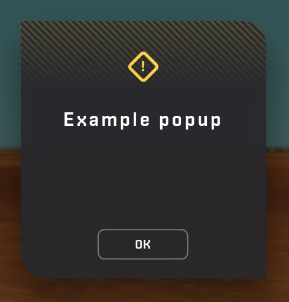
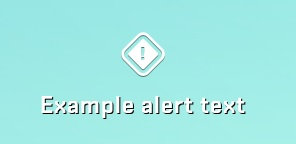

# Display Message

Displays a message in a warning pop-up, alert HUD, or in the chat.

- **ID**: 0x12 (18)
- **Size**: Variable
- **LZ4 Compressed**: Yes
- **State**: Playing
- **Bound To**: Server -> Client

## Structure

| Offset             | Field Name   | Field Type  | Notes |
|--------------------|--------------|-------------|-------|
| 0x00               | Type Size    | be u16      | The size of the type of the message. |
| 0x02               | Type         | utf8 string | The utf-8 encoded type of the message. |
| 0x02 + `Type Size` | Message Size | be u16      | The size of the message. |
| 0x04 + `Type Size` | Message      | utf8 string | The utf-8 encoded message. |

## Message types

How the message is displayed depends on the contents of the `Type` field. If this field is set to `<WARNING>` or `<ALERT>`, the message is displayed as a pop-up or as an alert. If the `Type` field contains any other value, the type and message are printed in the chat instead.

| Type string | Location |
|-------------|----------|
| `<WARNING>` | [Pop-up](#pop-up) |
| `<ALERT>`   | [Alert text](#alert-text) |
| Other       | [Chat](#chat) |

### Pop-up

If the `Type` field is set to `<WARNING>`, a pop-up with an exclaimation mark icon is displayed. The `Message` field is used as the caption, with space for a single line. It is not possible to provide a custom message body, but special `Message` values can set the caption and body to hardcoded values.

While the pop-up is open, the player is able to move, but unable to look around.

#### Special messages

If the `Type` field is set to `<WARNING>` and the `Message` field is set to any of the following special messages, the caption and body of the popup are set to their corresponding values. The interface tags are translated by MyGUI into the localized versions. The English localizations are listed below.

<table>
    <thead>
        <tr>
            <th>Message</th>
            <th>Caption</th>
            <th>Body</th>
        </tr>
    </thead>
    <tbody>
        <tr>
            <td rowspan="2">
                <code>WARNING_TUNNELING</code>
            </td>
            <td>
                <code>{"#{WARNING_TUNNELING_TITLE}"}</code>
            </td>
            <td>
                <code>{"#{WARNING_TUNNELING_LINE1}\n#{WARNING_TUNNELING_LINE2}"}</code>
            </td>
        </tr>
        <tr>
            <td>
                <code>{"Hey!"}</code>
            </td>
            <td>
                <code>{"You're playing the game wrong!\nStop that!"}</code>
            </td>
        </tr>
        <tr>
            <td rowspan="2">
                <code>VERSION_MISMATCH</code>
            </td>
            <td>
                <code>{"#{ERRMSG_TITLE_FAILED_TO_LOAD_WORLD}"}</code>
            </td>
            <td>
                <code>{"#{ERRMSG_VERSION_MISMATCH_LINE1}\n#{ERRMSG_VERSION_MISMATCH_LINE2}"}</code>
            </td>
        </tr>
        <tr>
            <td>
                <code>{"Failed to load world"}</code>
            </td>
            <td>
                <code>{"Version mismatch\nPlease update your client and try again"}</code>
            </td>
        </tr>
        <tr>
            <td rowspan="2">
                <code>CONNECTION_FAILED</code>
            </td>
            <td>
                <code>{"#{ERRMSG_TITLE_CONNECTION_FAILED}"}</code>
            </td>
            <td rowspan="2">
                <code>{"\n"}</code>
            </td>
        </tr>
        <tr>
            <td>
                <code>{"Connection failed"}</code>
            </td>
        </tr>
        <tr>
            <td rowspan="2">
                <code>CONNECTION_TIMEOUT</code>
            </td>
            <td>
                <code>{"#{ERRMSG_TITLE_CONNECTION_FAILED}"}</code>
            </td>
            <td>
                <code>{"#{ERRMSG_CONNECTION_TIMEOUT_LINE1}\n#{ERRMSG_CONNECTION_TIMEOUT_LINE2}"}</code>
            </td>
        </tr>
        <tr>
            <td>
                <code>{"Connection failed"}</code>
            </td>
            <td>
                <code>{"Connection to host timed out\nPlease check your Internet connection and try again"}</code>
            </td>
        </tr>
        <tr>
            <td rowspan="2">
                <code>CONNECTION_LOST</code>
            </td>
            <td>
                <code>{"#{ERRMSG_TITLE_CONNECTION_LOST}"}</code>
            </td>
            <td>
                <code>{"#{ERRMSG_CONNECTION_LOST_LINE1}\n#{ERRMSG_CONNECTION_LOST_LINE2}"}</code>
            </td>
        </tr>
        <tr>
            <td>
                <code>{"Connection lost"}</code>
            </td>
            <td>
                <code>{"Connection lost\nPlease check your Internet connection"}</code>
            </td>
        </tr>
        <tr>
            <td rowspan="2">
                <code>SERVER_SHUTDOWN</code>
            </td>
            <td>
                <code>{"#{ERRMSG_TITLE_CONNECTION_LOST}"}</code>
            </td>
            <td>
                <code>{"#{ERRMSG_SERVER_SHUTDOWN_LINE1}\n"}</code>
            </td>
        </tr>
        <tr>
            <td>
                <code>{"Connection lost"}</code>
            </td>
            <td>
                <code>{"Host has shut down\n"}</code>
            </td>
        </tr>
        <tr>
            <td rowspan="2">
                <code>KICKED_FROM_SERVER</code>
            </td>
            <td>
                <code>{"#{ERRMSG_TITLE_CONNECTION_LOST}"}</code>
            </td>
            <td>
                <code>{"#{ERRMSG_KICKED_FROM_SERVER_LINE1}\n#{ERRMSG_KICKED_FROM_SERVER_LINE2}"}</code>
            </td>
        </tr>
        <tr>
            <td>
                <code>{"Connection lost"}</code>
            </td>
            <td>
                <code>{"You have been kicked\nfrom the host"}</code>
            </td>
        </tr>
        <tr>
            <td rowspan="2">
                <code>UNLOAD_MOD</code>
            </td>
            <td>
                <code>{"#{ERRMSG_TITLE_WARNING}"}</code>
            </td>
            <td>
                <code>{"#{ERRMSG_UNLOAD_MOD_LINE1}\n#{ERRMSG_UNLOAD_MOD_LINE2}\n#{ERRMSG_UNLOAD_MOD_LINE3}"}</code>
            </td>
        </tr>
        <tr>
            <td>
                <code>{"Warning"}</code>
            </td>
            <td>
                <code>{"A previously used mod has been removed!\nThis might cause the world to be unloadable.\nDo you want to do this?"}</code>
            </td>
        </tr>
        <tr>
            <td rowspan="2">
                <code>INVALID_SHAPE_ID</code>
            </td>
            <td>
                <code>{"#{ERRMSG_TITLE_ERROR}"}</code>
            </td>
            <td>
                <code>{"#{ERRMSG_INVALID_SHAPE_ID}\n#{ERRMSG_REQUIRED_MOD}: #{UNKNOWN_MOD}"}</code>
            </td>
        </tr>
        <tr>
            <td>
                <code>{"ERROR"}</code>
            </td>
            <td>
                <code>{"The world contains an unsupported part\nRequired mod: <Unknown mod>"}</code>
            </td>
        </tr>
        <tr>
            <td rowspan="2">
                <code>ERROR_MESSAGE</code>
            </td>
            <td>
                <code>{"#{ERRMSG_TITLE_ERROR}"}</code>
            </td>
            <td rowspan="2">
                <code>{"\n"}</code>
            </td>
        </tr>
        <tr>
            <td>
                <code>{"ERROR"}</code>
            </td>
        </tr>
        <tr>
            <td rowspan="2">
                <code>DATABASE_ERROR_MESSAGE</code>
            </td>
            <td>
                <code>{"#{ERRMSG_TITLE_ERROR}"}</code>
            </td>
            <td>
                <code>{"#{ERRMSG_DATABASE_ISSUE}: \n\n"}</code>
            </td>
        </tr>
        <tr>
            <td>
                <code>{"ERROR"}</code>
            </td>
            <td>
                <code>{"A problem occurred when handling the save file: \n\n"}</code>
            </td>
        </tr>
    </tbody>
</table>

### Alert text

If the `Type` field is set to `<ALERT>`, a text message with an exclaimation mark icon is displayed in the center top of the HUD. The `Message` field is used as the text of the message, with space for a single line.

### Chat

If the `Type` field is set to neither `<WARNING>` nor `<ALERT>`, the `Type` field and the `Message` are joined by the string `: ` and the result is printed to the chat.

## Known messages

List of known messages that the server can send to the client.

| Type | Message | Occurs When |
|------|---------|-------|
| `<WARNING>` | `WARNING_TUNNELING` | The player falls through the ground and hits the teleportation area trigger. |
